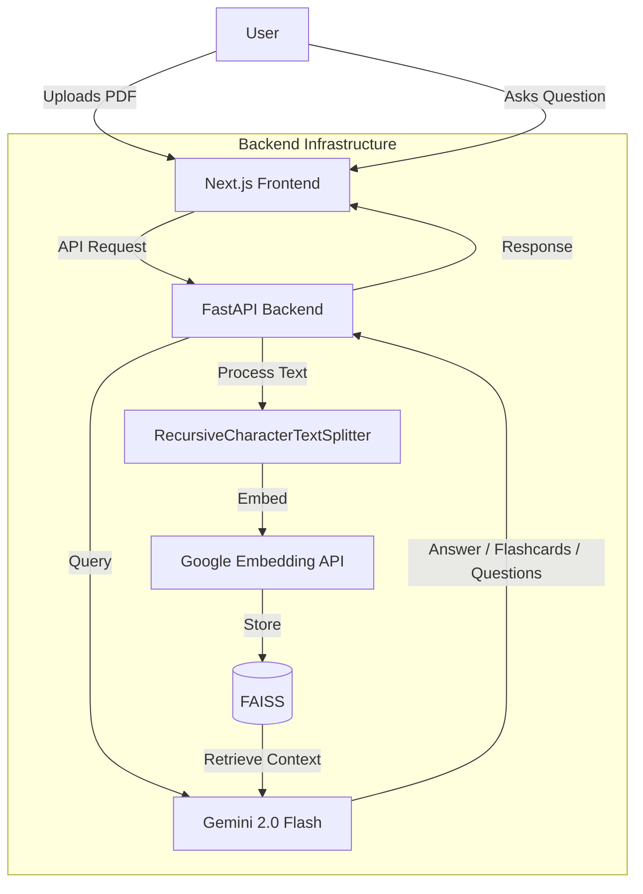

# PadhAI Dost

**Your AI-Powered Study Companion**

PadhAI Dost (Scholar Friend) is an intelligent learning assistant that transforms static documents into interactive learning experiences. Upload any PDF, ask questions grounded in the source text, generate flashcards, and get multi-level explanations — all powered by RAG (Retrieval Augmented Generation).

[](https://padhai-dost-v2.vercel.app)
[](LICENSE)

---

## Key Features

| Feature | Description |
|---|---|
| **Contextual Chat** | Ask questions about your documents and get answers with source attribution via hybrid RAG (semantic + keyword search) |
| **Auto-Flashcards** | Upload a PDF and instantly generate key-concept flashcards using LLM extraction |
| **Practice Questions (Pucho)** | Auto-generated questions using Bloom's Taxonomy with adjustable difficulty (1-10) and question types (Objective/Subjective) |
| **Multi-Level Explanations (Samjha Do)** | Get Beginner, Intermediate, or Advanced explanations of any document |
| **Document Processing** | Supports PDF, TXT, PNG, and JPEG (OCR via Tesseract) |
| **Learning Analytics** | Track documents studied, messages exchanged, and learning progress |

---

## Tech Stack

**Frontend**: Next.js 16, TypeScript, Tailwind CSS, React 19

**Backend**: Python (FastAPI), LangChain, FAISS (Vector Store)

**AI/ML**: Google Gemini 2.0 Flash, Google Embedding API

**Database**: SQLite (Prisma ORM), NextAuth.js (Authentication)

**Deployment**: Vercel (Frontend), Render (Backend)

---

## Architecture



---

## Getting Started

### Prerequisites
- Node.js 18+
- Python 3.10+

### Installation

1. **Clone the repository**
   ```bash
   git clone https://github.com/Abhics8/PadhAI-Dost.git
   cd PadhAI-Dost
   ```

2. **Frontend Setup**
   ```bash
   npm install
   cp .env.example .env.local  # Add your keys
   npx prisma generate
   npx prisma db push
   npm run dev
   ```

3. **Backend Setup**
   ```bash
   cd python-backend
   python -m venv venv
   source venv/bin/activate  # Windows: venv\Scripts\activate
   pip install -r requirements.txt
   uvicorn api:app --reload
   ```

4. **Environment Variables**

   Create a `.env.local` file in the root:
   ```env
   DATABASE_URL="file:./dev.db"
   AUTH_SECRET="your-secret-key"
   PYTHON_BACKEND_URL="http://127.0.0.1:8000"
   ```

   Create a `.env` file in `python-backend/`:
   ```env
   GEMINI_API_KEY=your_gemini_api_key
   ALLOWED_ORIGINS=http://localhost:3000
   ```

---

## API Endpoints

| Method | Endpoint | Description |
|---|---|---|
| `POST` | `/upload` | Upload and process a document (PDF, TXT, PNG, JPEG) |
| `POST` | `/chat` | Chat with the uploaded document via RAG |
| `POST` | `/pucho` | Generate practice questions with configurable difficulty |
| `POST` | `/explain` | Get multi-level explanations of the document |
| `POST` | `/generate-flashcards` | Auto-generate flashcards from document content |
| `GET` | `/` | Health check |

---

## Project Structure

```
PadhAI-Dost/
├── app/                    # Next.js App Router
│   ├── api/                # API routes (chat, upload, pucho, explain, progress)
│   ├── (dashboard)/        # Dashboard and document management pages
│   └── page.tsx            # Landing page
├── components/             # React components (chat UI, uploader, sidenav)
├── prisma/                 # Database schema
├── python-backend/         # FastAPI backend
│   ├── api.py              # Main API server
│   ├── rag_pipeline.py     # FAISS + LangChain RAG pipeline
│   ├── pucho.py            # Question generation (Bloom's Taxonomy)
│   ├── samjha_do.py        # Multi-level explanation engine
│   ├── flashcard_generator.py  # LLM-powered flashcard generation
│   └── document_loader.py  # PDF/TXT/Image document parser
└── lib/                    # Shared utilities (Prisma client)
```

---

## Contributing

1. Fork the project
2. Create your feature branch (`git checkout -b feature/YourFeature`)
3. Commit your changes (`git commit -m 'Add YourFeature'`)
4. Push to the branch (`git push origin feature/YourFeature`)
5. Open a Pull Request

---

## Contact

**Abhi Bhardwaj** - [Portfolio](https://abhics8.github.io/Portfolio) - [GitHub](https://github.com/Abhics8)

---

## License

Distributed under the MIT License. See `LICENSE` for more information.
