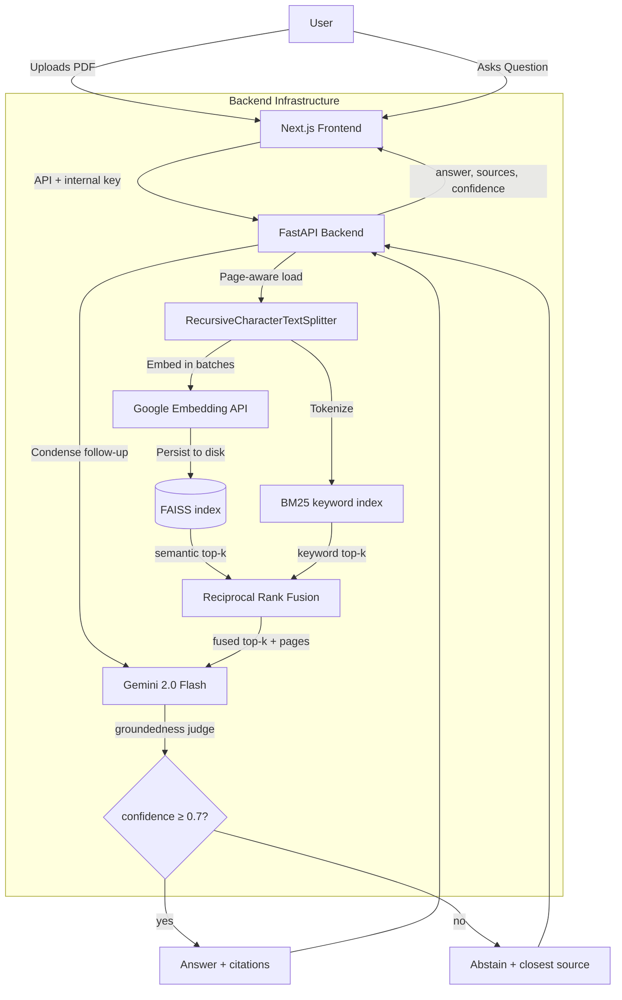

# PadhAI Dost

**Your AI-Powered Study Companion**

PadhAI Dost (Scholar Friend) is an intelligent learning assistant that transforms static documents into interactive learning experiences. Upload any PDF, ask questions grounded in the source text, generate flashcards, and get multi-level explanations — all powered by RAG (Retrieval Augmented Generation).

[](https://padhai-dost-v2.vercel.app)
[](LICENSE)

---

## Key Features

| Feature | Description |
|---|---|
| **Hybrid RAG Chat** | BM25 keyword + FAISS semantic retrieval, fused with Reciprocal Rank Fusion, with **inline source citations** (page number, relevance score, which retriever surfaced each chunk) |
| **Multi-Turn Conversation** | Follow-up questions ("explain that more simply") are rewritten into standalone questions using recent chat history before retrieval |
| **Confidence Scoring & Abstention** | Every answer is graded for groundedness by an LLM judge; low-confidence answers abstain and surface the closest source instead of hallucinating |
| **Auto-Flashcards** | Upload a PDF and instantly generate key-concept flashcards using LLM extraction |
| **Practice Questions (Pucho)** | Auto-generated questions using Bloom's Taxonomy with adjustable difficulty (1-10) and question types (Objective/Subjective) |
| **Multi-Level Explanations (Samjha Do)** | Get Beginner, Intermediate, or Advanced explanations of any document |
| **Document Processing** | Page-aware loading of PDF, TXT, PNG, and JPEG (OCR via Tesseract); page numbers flow through to citations |
| **Evaluation Framework** | RAGAS-style offline eval (retrieval precision/recall@k, faithfulness, answer relevance) over a hand-curated golden dataset, gated in CI |
| **Observability** | Structured JSON logging on every request, plus a `/metrics` endpoint (p50/p95/p99 latency, error rates, token estimates) |

---

## Tech Stack

**Frontend**: Next.js 16, TypeScript, Tailwind CSS, React 19

**Backend**: Python (FastAPI), LangChain, FAISS (Vector Store)

**AI/ML**: Google Gemini 2.0 Flash, Google Embedding API, FAISS + BM25 hybrid retrieval

**Database**: PostgreSQL (Prisma ORM, Neon), NextAuth.js (Authentication)

**Deployment**: Vercel (Frontend), Render (Backend)

---

## Evaluation Results

Measured by `eval/evaluate_rag.py` over a 30-question hand-curated golden dataset
(`eval/golden_dataset.json`) on the bundled `sample_doc.txt`. Retrieval metrics below
are **real, reproducible numbers** from an actual run (`k=4`):

| Metric | Score | Notes |
|---|---|---|
| **Retrieval recall@4 (hit-rate)** | **1.00** | Every question's ground-truth page appears in the top-4 fused chunks |
| Retrieval precision@4 | 0.26 | Capped low by design: a 5-page doc with single-page ground truth means ≈1 of 4 retrieved chunks can be "on-page" |
| Faithfulness | _run with API quota_ | LLM-as-judge; gated at ≥0.90 in CI |
| Answer relevance | _run with API quota_ | LLM-as-judge |

> Reproduce: `GEMINI_API_KEY=... python eval/evaluate_rag.py --k 4`.
> The faithfulness/answer-relevance judges require LLM calls; on the free tier run
> them when daily quota is available. CI fails the build if recall@4 < 0.85 or
> faithfulness < 0.90.

---

## Architecture



---

## Getting Started

### Prerequisites
- Node.js 18+
- Python 3.10+

### Installation

1. **Clone the repository**
   ```bash
   git clone https://github.com/Abhics8/PadhAI-Dost.git
   cd PadhAI-Dost
   ```

2. **Frontend Setup**
   ```bash
   npm install
   cp .env.example .env.local  # Add your keys
   npx prisma generate
   npx prisma db push
   npm run dev
   ```

3. **Backend Setup**
   ```bash
   cd python-backend
   python -m venv venv
   source venv/bin/activate  # Windows: venv\Scripts\activate
   pip install -r requirements.txt
   uvicorn api:app --reload
   ```

4. **Environment Variables**

   Create a `.env.local` file in the root:
   ```env
   DATABASE_URL="file:./dev.db"
   AUTH_SECRET="your-secret-key"
   PYTHON_BACKEND_URL="http://127.0.0.1:8000"
   ```

   Create a `.env` file in `python-backend/`:
   ```env
   GEMINI_API_KEY=your_gemini_api_key
   ALLOWED_ORIGINS=http://localhost:3000
   INTERNAL_API_KEY=change-me   # must match the root .env; secures backend calls
   INDEX_ROOT=indices           # where persisted FAISS indices live
   ```

---

## API Endpoints

The Python backend is **not** exposed to the public internet directly: every
request must carry `X-Internal-API-Key` (set by the Next.js layer after NextAuth
authenticates the user), and the `session_id` is derived server-side from the
user's id — it is never accepted from the client.

| Method | Endpoint | Description |
|---|---|---|
| `POST` | `/upload` | Upload and index a document (PDF, TXT, PNG, JPEG); skips re-embedding identical files |
| `POST` | `/chat` | Hybrid-RAG chat; returns `{answer, sources[], confidence, grounded}` with conversation history support |
| `POST` | `/debug/retrieve` | Retrieval-only debug view: the fused chunks (text, page, score, retrievers) for a query |
| `POST` | `/clear-session` | Detach a session from its document and clear cached answers |
| `POST` | `/pucho` | Generate practice questions with configurable difficulty |
| `POST` | `/explain` | Get multi-level explanations of the document |
| `POST` | `/generate-flashcards` | Auto-generate flashcards from document content |
| `GET`  | `/metrics` | p50/p95/p99 latency, error rates, and LLM token estimates |
| `GET`  | `/cache-stats` | Query-cache hit rate and loaded-session count |
| `GET`  | `/` | Health check |

### Chat response shape

```json
{
  "answer": "Photosynthesis converts light energy into glucose [1]...",
  "sources": [
    {"page": 1, "text": "6 CO2 + 6 H2O + light...", "score": 1.0, "retrievers": ["semantic", "keyword"]},
    {"page": 2, "text": "The light-dependent reactions...", "score": 0.83, "retrievers": ["semantic"]}
  ],
  "confidence": 0.94,
  "grounded": true
}
```

---

## Project Structure

```
PadhAI-Dost/
├── app/                    # Next.js App Router
│   ├── api/                # API routes (chat, upload, pucho, explain, progress)
│   ├── (dashboard)/        # Dashboard and document management pages
│   └── page.tsx            # Landing page
├── components/             # React components (chat UI, uploader, sidenav)
├── prisma/                 # Database schema
├── python-backend/         # FastAPI backend
│   ├── api.py              # Main API server
│   ├── rag_pipeline.py     # FAISS + LangChain RAG pipeline
│   ├── pucho.py            # Question generation (Bloom's Taxonomy)
│   ├── samjha_do.py        # Multi-level explanation engine
│   ├── flashcard_generator.py  # LLM-powered flashcard generation
│   └── document_loader.py  # PDF/TXT/Image document parser
└── lib/                    # Shared utilities (Prisma client)
```

---

## Contributing

1. Fork the project
2. Create your feature branch (`git checkout -b feature/YourFeature`)
3. Commit your changes (`git commit -m 'Add YourFeature'`)
4. Push to the branch (`git push origin feature/YourFeature`)
5. Open a Pull Request

---

## Contact

**Abhi Bhardwaj** - [Portfolio](https://abhics8.github.io/Portfolio) - [GitHub](https://github.com/Abhics8)

---

## License

Distributed under the MIT License. See `LICENSE` for more information.
